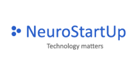

# **Neuro Start Up**

**NeuroStartUp** — динамически развивающийся стартап, специализирующийся на поиске с использованием новейших технологий искусственного интеллекта. Наши преимущества:
- *Высокая точность поиска*
- *Высокая скорость поиска*
- *Низкая цена*

## Искусственный интеллект
**Искусственный интеллект** (*artificial intelligence*) — это принятое в информатике обозначение программных систем, способных моделировать интеллектуальную деятельность человека. Выполняя задачи, ИИ постепенно обучается, используя собранную информацию. Этим же термином называют раздел информатики, посвященный разработке таких систем. ([статья Wiki](https://ru.wikipedia.org/wiki/Искусственный_интеллект))

> #### ***Стивен Хокинг:*** 
> *Я думаю, что наш разум — это программа, в то время как мозг — аналог компьютера. Теоретически возможно скопировать содержимое мозга на компьютер и таким образом создать форму вечной жизни. Сегодня, однако, это не в наших силах.*

###    **Некоторые примеры известных ИИ-систем**

1. **Deep Blue** — разработанный IBM, победил чемпиона мира по шахматам Гарри Каспарова.
1. **AlphaGo** — разработанной Google DeepMind, выиграл матч в го у корейского профессионала 9 дана Ли Седоля.
1. **Watson** — перспективная разработка IBM, способная воспринимать человеческую речь и производить вероятностный поиск, с применением большого количества алгоритмов и т.д.

## Поиск специалистов

В настоящее время проект **NeuroStartUp** ведет поиск специалистов зарекомендовавших себя в разработке и внедрении программ ИИ.

## Требования к соискателяv

- понимание алгоритмов ИИ
- свободное владение такими языками программирования как ``Python``, ``C++``, ``Jawa``...
- навыки работы с ``Git`` b ``GitHub`` приветствуются